# INE EWPTX — Advanced Web Application Penetration Testing

## Course Overview

**Intro to Advanced Web Application Penetration Testing**

### Major Topics

- Web Application Pentesting Methodology
- Planning Web App Pentests
- Pre-Engagement Phase
- Web App Mapping & Crawling
- Reconnaissance
- Session Security

---

## Web Application Pentesting Methodology

Web application penetration testing is a comprehensive security assessment aimed at identifying vulnerabilities and weaknesses in web applications.

It involves simulating real-world attacks to evaluate the application's security posture and provide recommendations for remediation.

Using a methodology for web application penetration testing is vitally important as it provides a structured and systematic approach to conduct thorough security assessments.

A web application penetration testing methodology helps:

- Identify potential vulnerabilities and weaknesses
- Assess the application's security posture
- Provide actionable recommendations for remediation

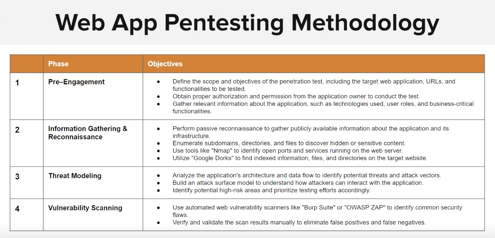

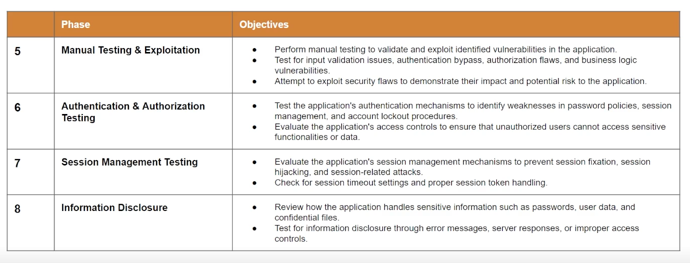

---

## Popular Methodologies

Several web application penetration testing methodologies exist that security professionals can follow. Each has its own approach and focus areas, but all share the common goal of identifying and mitigating security vulnerabilities.

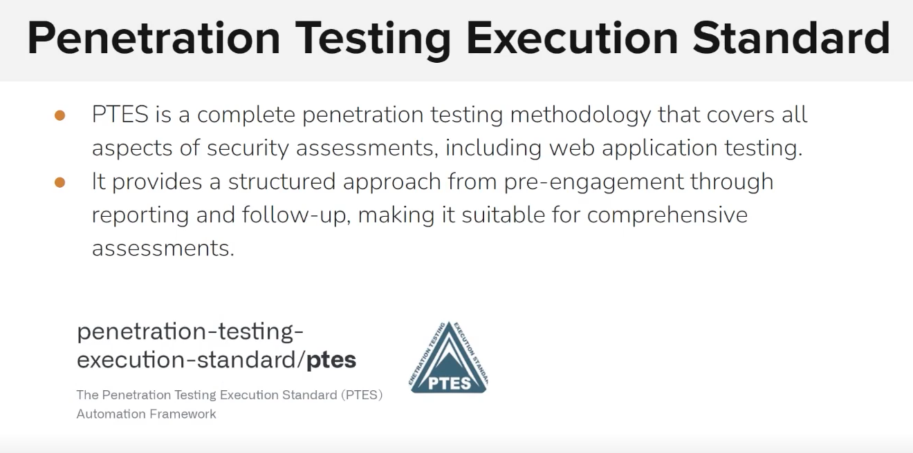

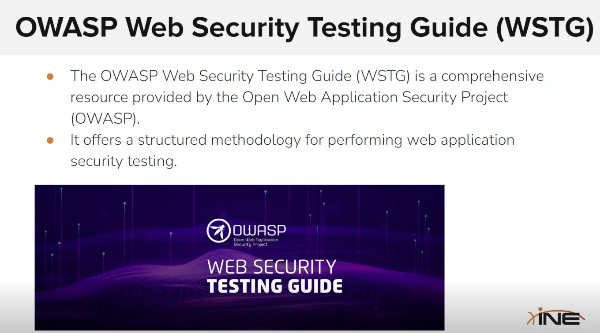

---

## OWASP Top 10

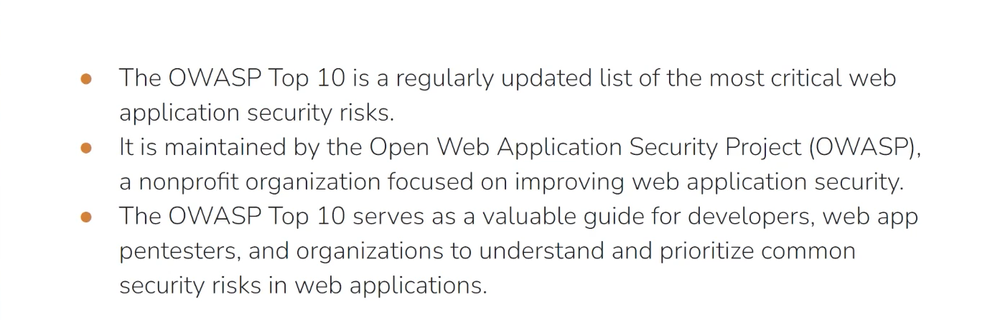

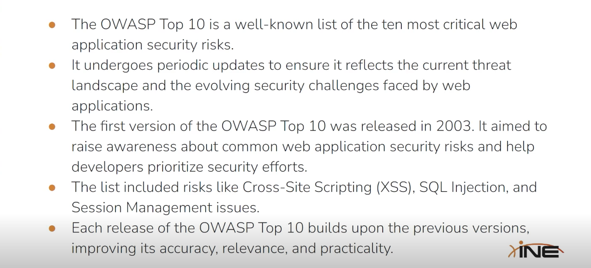

---

## Web Application Security Testing

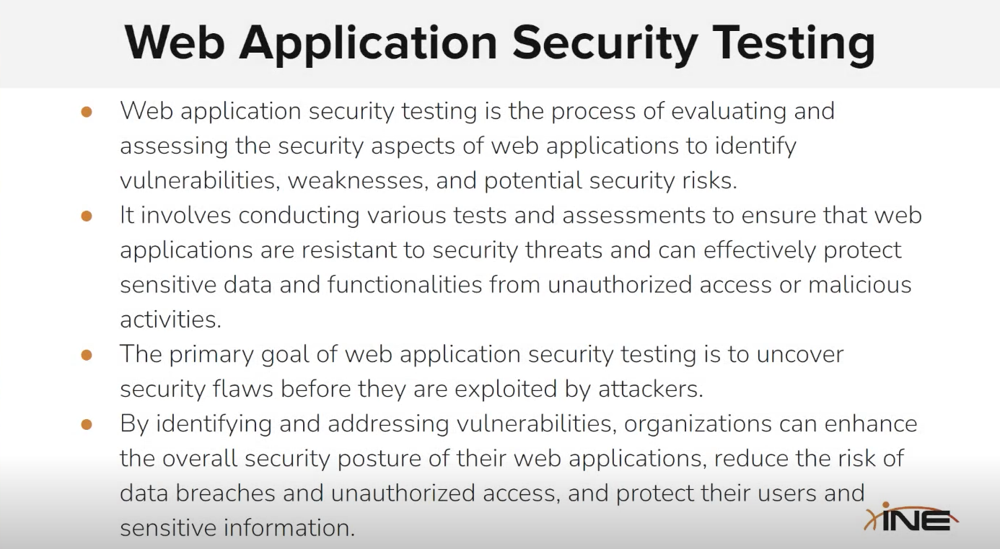

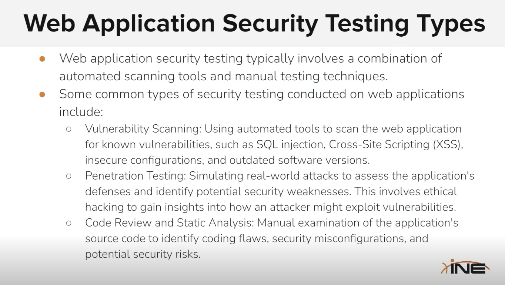

### Web Application Penetration Testing

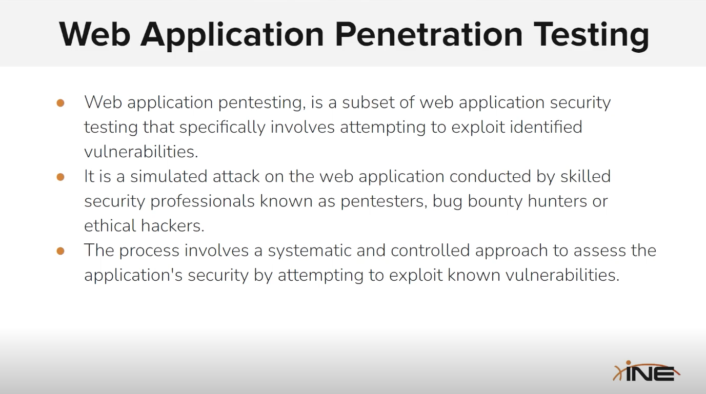

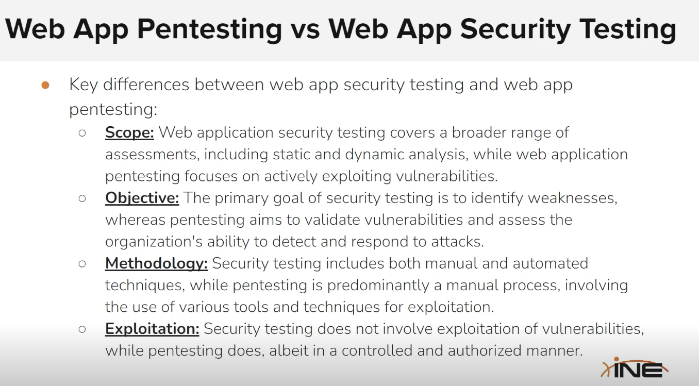

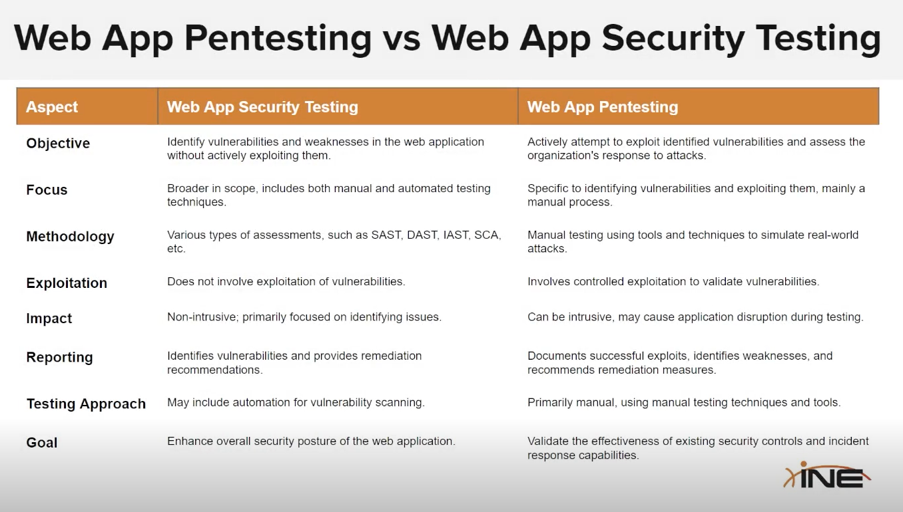

---

## OWASP Web Security Testing Guide (WSTG)

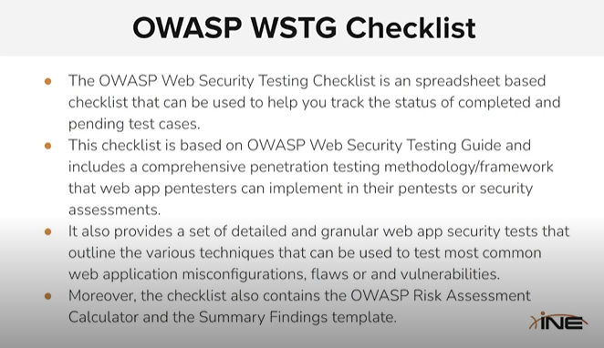

---

## Pre-Engagement Phase

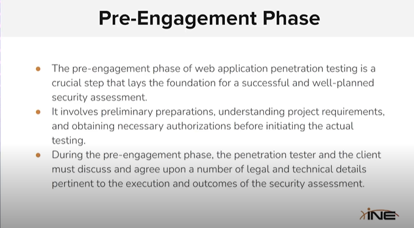

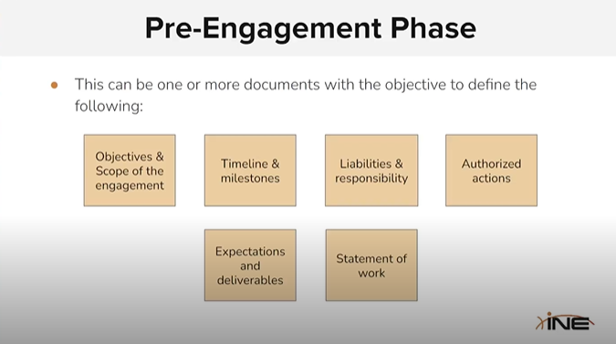

### EyeWitness

Tool for web application reconnaissance and screenshotting.

- GitHub: [https://github.com/RedSiege/EyeWitness](https://github.com/RedSiege/EyeWitness)

---

## Website Recon and Footprinting

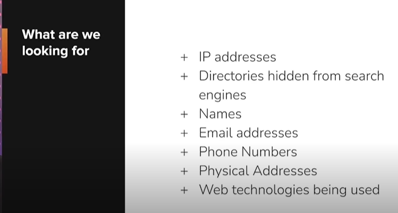

### Key Commands & Tools

| Tool | Purpose |
|------|---------|
| `host` | DNS lookup |
| `robots.txt` | Discover disallowed paths |
| `sitemap.xml` | Map all pages |
| `builtwith` / `wappalyzer` | Web technology profiler |
| `whatweb` | Web fingerprinting |
| `httrack` | Website copier |
