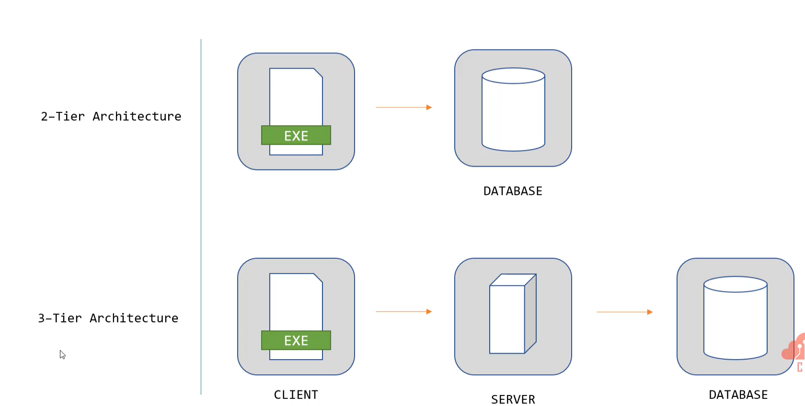
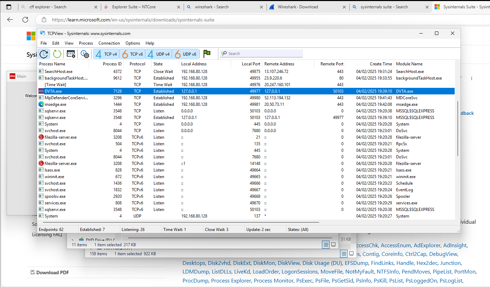
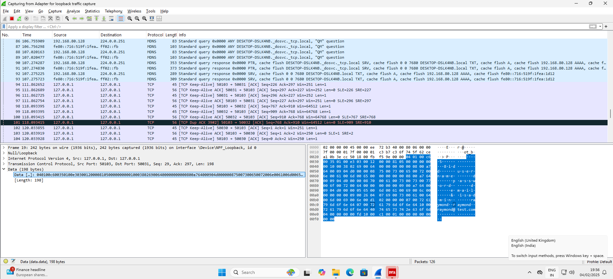
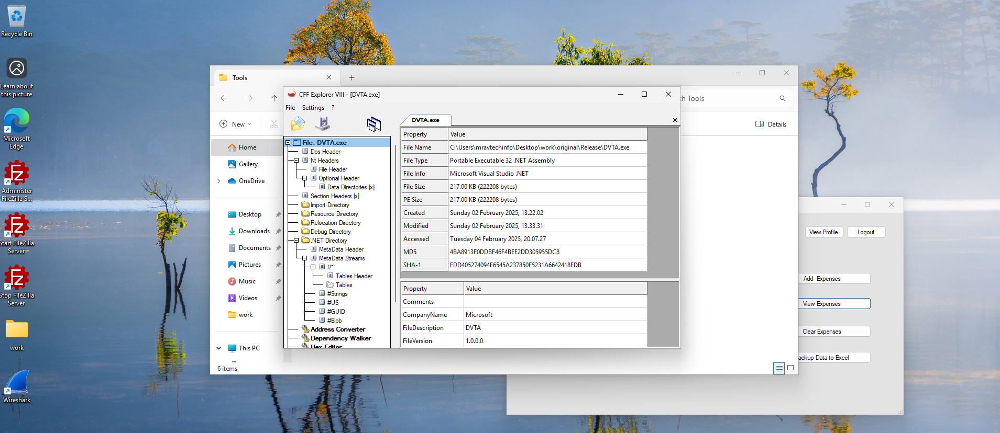
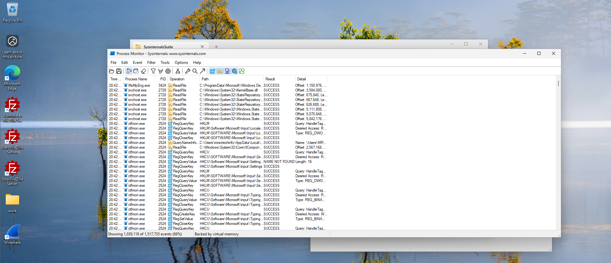
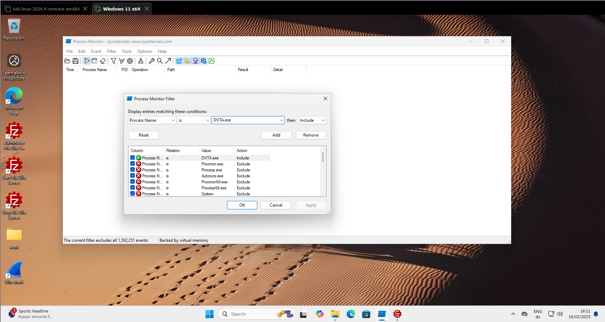
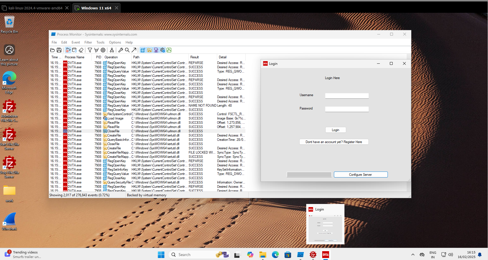
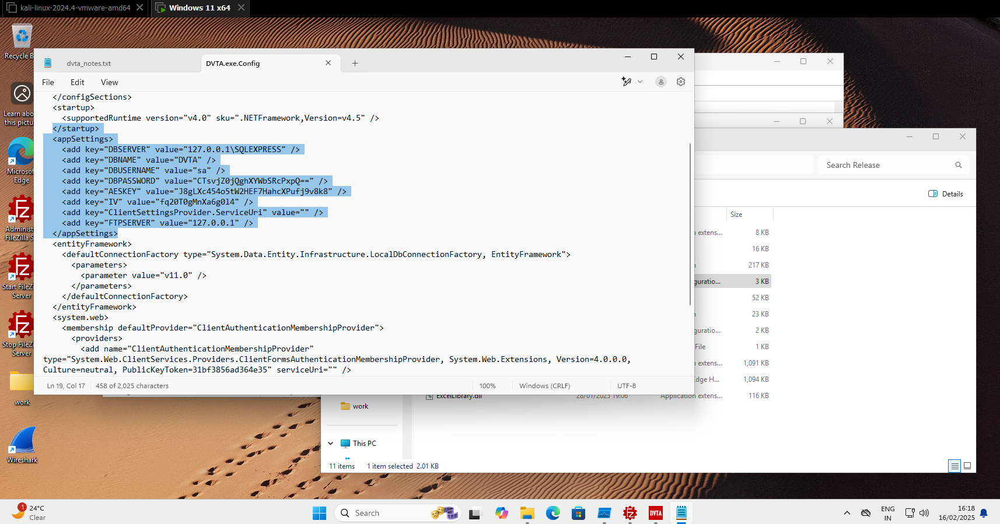

1. Introduction
2. Static and Dynamic Analysis
3. Reverse Engineering
4. Automated Security Audits

Introduction
2-tier application
3-tier application

Architecture

we are going to use here DVTA Damn Vulnerable Thick client Application

dnspy version which to use is based upon the version (32 bit or 64 bit) which the application you are testing.

Information Gathering
Exploring functionality of the application
Architecture of the application
Client's network communication
Files that can be accessed by the client
Look for juicy files

Tool for the task
CFF explorer
Sysinternal suite
Wireshark

TCP view is used for analyzing the target application that it is connecting to which destination IP address.

Network traffic or network connection monitoring with Wireshark, how the target application traffic flows after the authentication and while using the function of the application.

CFF explorer is use to analyze how the binary is built. What languages are used built the binary.

Similarly Procmon is used for process monitoring of the target application.
 

You can filter among all the process shown by the tool to your chosen application (target application)
 

 

You can even check for registry entry with the name of your target application to look for something useful or interesting (storing credentials, if the user is logged in or not)
Storing session info in registry.

Traffic Analysis
Intercepting HTTP Traffic:
Burp is used to analyze http traffic.
Intercepting TCP Traffic:
• Wireshark
• Echo Mirage (Very Old and not maintained)
• MITM-RELAY + Burp Suite

