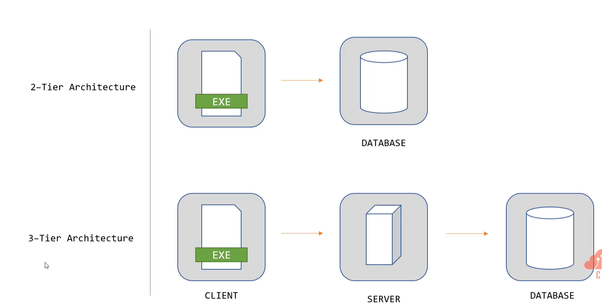
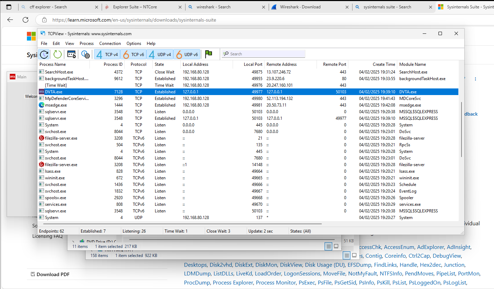
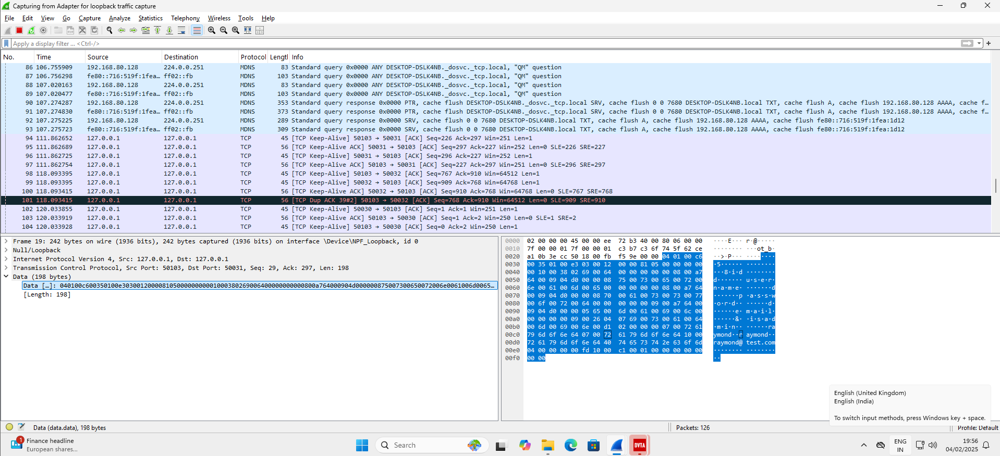
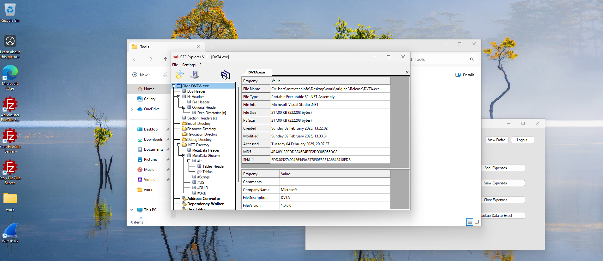
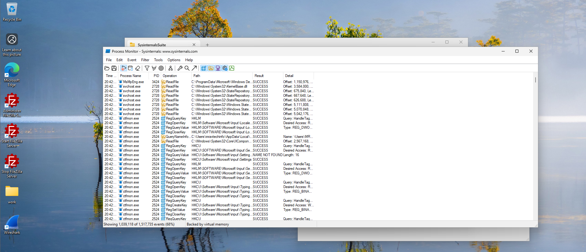
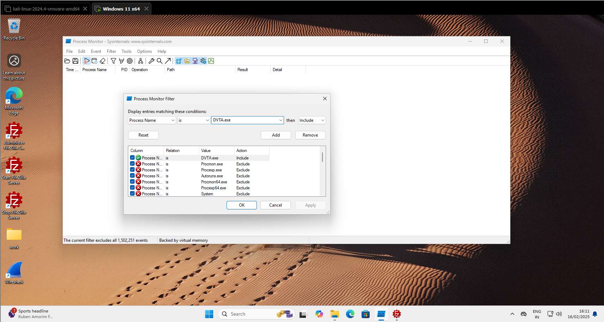
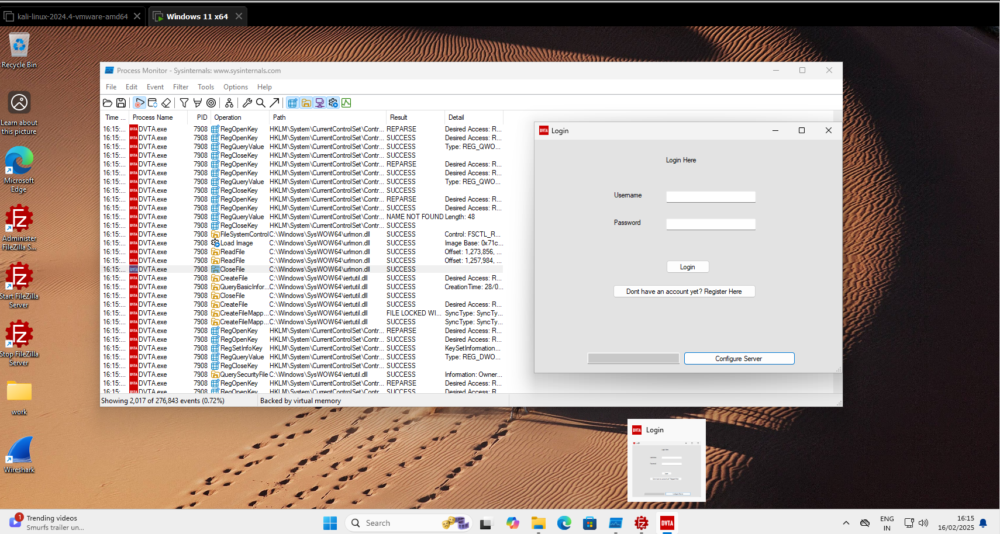
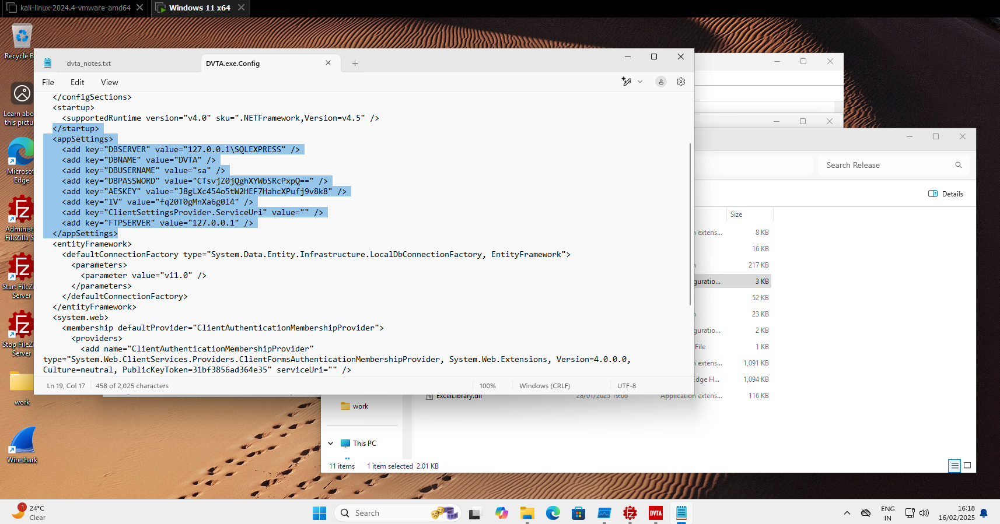

# Pentesting Thick Client Applications

## Course Outline

1. Introduction
2. Static and Dynamic Analysis
3. Reverse Engineering
4. Automated Security Audits

---

## Introduction

### Application Architecture

- **2-tier application** — client communicates directly with the database
- **3-tier application** — client communicates with a middleware/application server

> Lab target: **DVTA** (Damn Vulnerable Thick Client Application)

**Note on dnSpy:** Use the 32-bit or 64-bit version based on the target application's architecture.

---

## Information Gathering

Goals:

- Explore functionality of the application
- Identify the architecture
- Analyze client's network communication
- Find files accessible by the client
- Look for sensitive/juicy files

### Tools

| Tool | Purpose |
|------|---------|
| CFF Explorer | Analyze binary structure and languages used |
| Sysinternals Suite | Process monitoring, registry inspection |
| Wireshark | Network traffic analysis |
| TCP View | Monitor active connections to destination IPs |
| Procmon | Process monitoring and file/registry activity |

---

## Static Analysis

### TCP View

Used to analyze which destination IP addresses the target application connects to.

### Wireshark

Monitor how the application's network traffic flows after authentication and during feature usage.

### CFF Explorer

Analyze the binary to determine what languages/frameworks were used to build it.

### Procmon (Process Monitor)

Used for process monitoring of the target application.

Filter processes to your target application:

You can also check **registry entries** by the target application name to look for:

- Stored credentials
- Login state (logged in / logged out)
- Session information

---

## Traffic Analysis

### Intercepting HTTP Traffic

- **Burp Suite** — intercept and analyze HTTP/HTTPS traffic

### Intercepting TCP Traffic

- **Wireshark** — passive capture
- **Echo Mirage** — *(very old, no longer maintained)*
- **MITM-RELAY + Burp Suite** — active TCP interception
